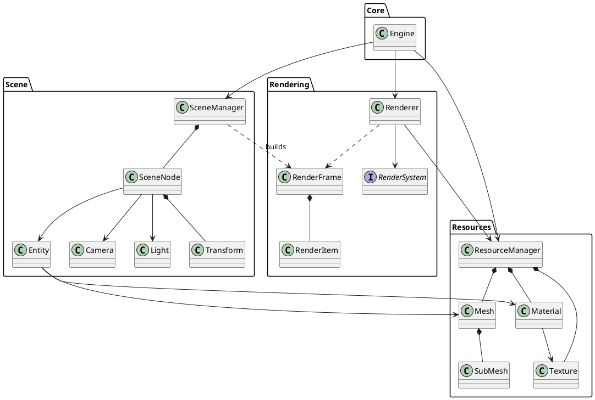
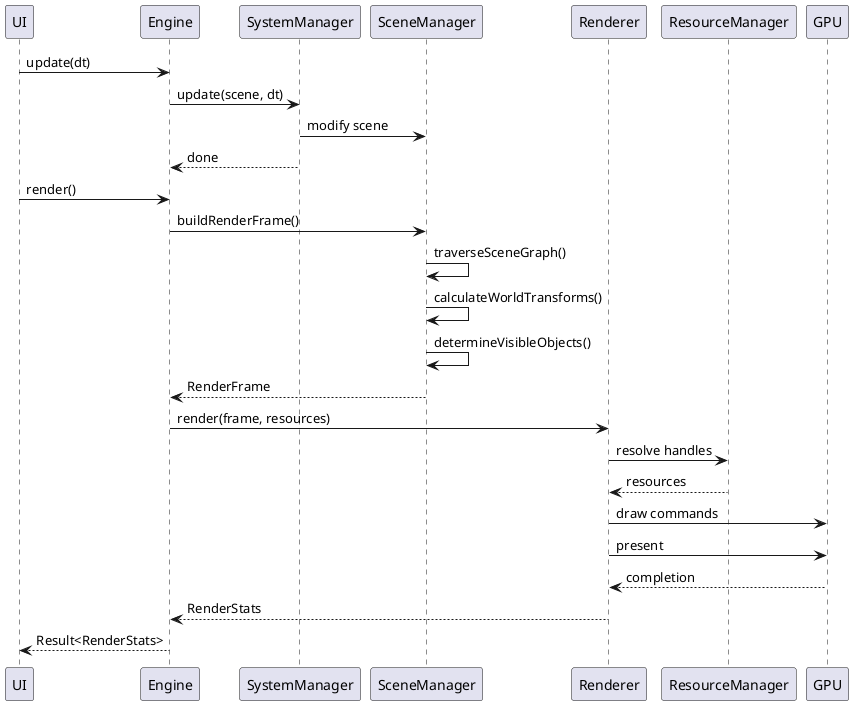
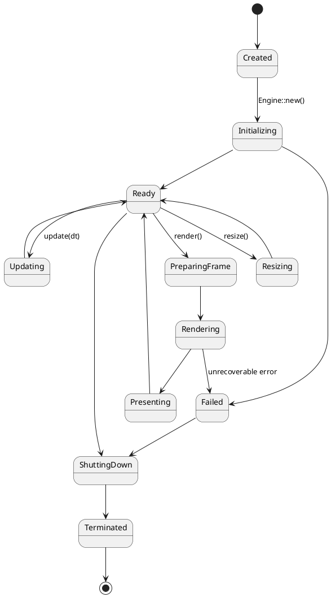
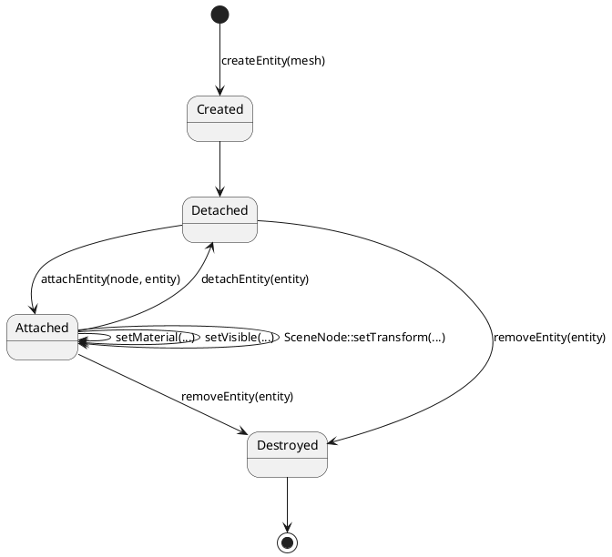
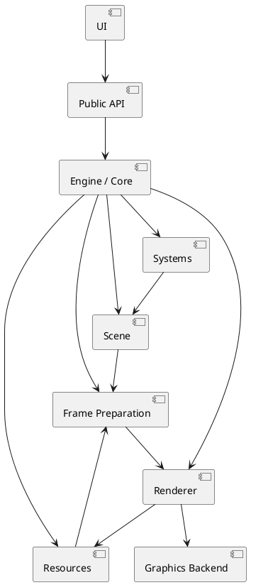

# FREAK Engine — архитектурная спецификация

## 1. Назначение документа

Этот документ фиксирует целевую архитектуру графического движка **FREAK Engine** на Rust.

Архитектура ориентируется прежде всего на идеи OGRE:

- `Root` как оркестратор;
- `SceneManager` как владелец сцены;
- `SceneNode` как пространственная иерархия;
- `MovableObject` как содержимое узла;
- `Entity` как экземпляр отображаемого объекта;
- `Mesh`, `Material`, `Texture` как разделяемые ресурсы;
- `RenderSystem` как абстракция конкретного графического API.

При этом архитектура не должна буквально копировать C++-модель OGRE. Она должна быть адаптирована к Rust и его типовой модели владения, ссылок, enum-типов и trait-интерфейсов.

---

# 2. Основные архитектурные принципы

1. Сцена должна быть отделена от рендеринга.
2. Пространственная иерархия должна быть отделена от отображаемого содержимого.
3. Экземпляр объекта сцены должен быть отделён от тяжёлого ресурса.
4. UI должен работать только через высокоуровневый публичный API движка.
5. Низкоуровневый renderer не должен знать о UI.
6. `Scene` не должна зависеть от конкретного GPU backend.
7. Основные зависимости между модулями должны быть однонаправленными.
8. Циклические зависимости между архитектурными модулями не допускаются.
9. Обратная передача данных должна происходить через возвращаемые значения, события или специализированные структуры данных.
10. Публичный API должен оперировать объектами предметной области, а не низкоуровневыми GPU-командами.

---

# 3. Главная архитектурная схема

```text
UI / Editor / Client Application
                |
                v
          Public Engine API
                |
                v
             Engine
        /        |        \
       v         v         v
    Scene     Resources   Systems
       \         |         /
        \        |        /
         v       v       v
          Frame Preparation
                |
                v
            RenderFrame
                |
                v
             Renderer
                |
                v
          RenderSystem
                |
                v
       wgpu / Vulkan / OpenGL
                |
                v
               GPU
```

---

# 4. Модуль `core`

## 4.1. Назначение

`core` содержит главный объект движка — `Engine`.

`Engine` является фасадом и оркестратором.

Он связывает:

- сцену;
- ресурсы;
- системы;
- renderer;
- lifecycle кадра.

## 4.2. Что делает `Engine`

`Engine` должен:

- инициализировать подсистемы;
- владеть или координировать основные модули;
- предоставлять публичную точку входа;
- выполнять `update`;
- инициировать `render`;
- управлять lifecycle движка;
- передавать данные между подсистемами.

## 4.3. Что `Engine` не должен делать

`Engine` не должен:

- самостоятельно хранить vertex/index data;
- самостоятельно создавать GPU draw calls;
- содержать UI;
- содержать бизнес-логику конкретного приложения;
- заменять собой SceneManager, ResourceManager или Renderer.

## 4.4. Предлагаемая структура

```rust
pub struct Engine {
    scene: SceneManager,
    resources: ResourceManager,
    renderer: Renderer,
    systems: SystemManager,
}
```

## 4.5. Минимальный публичный API

```rust
impl Engine {
    pub fn new(config: EngineConfig) -> Result<Self, EngineError>;

    pub fn scene(&self) -> &SceneManager;
    pub fn scene_mut(&mut self) -> &mut SceneManager;

    pub fn resources(&self) -> &ResourceManager;
    pub fn resources_mut(&mut self) -> &mut ResourceManager;

    pub fn update(
        &mut self,
        dt: Duration,
    ) -> Result<(), EngineError>;

    pub fn render(
        &mut self,
    ) -> Result<RenderStats, EngineError>;
}
```

---

# 5. Модуль `scene`

## 5.1. Назначение

Модуль `scene` отвечает за:

> что существует в виртуальном мире и где оно расположено.

Он не должен выполнять GPU-команды.

## 5.2. Основные сущности

```text
SceneManager
SceneNode
Transform
Entity
Camera
Light
SceneObjectId
```

---

# 6. `SceneManager`

## 6.1. Ответственность

`SceneManager` является владельцем логической сцены.

Он должен:

- хранить корневой `SceneNode`;
- создавать и удалять nodes;
- создавать и удалять entities;
- создавать камеры;
- создавать источники света;
- прикреплять объекты к nodes;
- откреплять объекты;
- хранить активную камеру;
- предоставлять traversal scene graph;
- подготавливать данные для RenderFrame.

## 6.2. Возможная структура

```rust
pub struct SceneManager {
    root: SceneNodeId,

    nodes: Arena<SceneNode>,
    entities: Arena<Entity>,
    cameras: Arena<Camera>,
    lights: Arena<Light>,

    active_camera: Option<CameraId>,
}
```

## 6.3. Главное правило

`SceneManager` знает структуру сцены, но не знает, как GPU рисует её содержимое.

---

# 7. `SceneNode`

## 7.1. Назначение

`SceneNode` отвечает за:

> WHERE — где находится объект.

Он описывает пространственную иерархию.

## 7.2. Возможная структура

```rust
pub struct SceneNode {
    parent: Option<SceneNodeId>,
    children: Vec<SceneNodeId>,
    objects: Vec<SceneObjectId>,
    local_transform: Transform,
}
```

## 7.3. В `SceneNode` должны находиться

```text
position
rotation
scale
parent
children
attached objects
```

## 7.4. В `SceneNode` не должны находиться

```text
Mesh
Texture
GPU Buffer
RenderPipeline
Shader Module
```

---

# 8. `Transform`

```rust
pub struct Transform {
    pub position: Vec3,
    pub rotation: Quat,
    pub scale: Vec3,
}
```

Минимальный интерфейс:

```rust
impl Transform {
    pub fn identity() -> Self;

    pub fn matrix(&self) -> Mat4;
}
```

World transform может вычисляться через иерархию:

```text
world_transform =
    parent_world_transform
    *
    local_transform
```

World transform не обязан постоянно храниться в node.

---

# 9. `MovableObject` / `SceneObjectId`

Архитектура должна сохранить концептуальную идею OGRE `MovableObject`, но не обязана повторять C++-иерархию наследования.

Для Rust предпочтительно использовать enum и strongly typed IDs.

```rust
pub enum SceneObjectId {
    Entity(EntityId),
    Camera(CameraId),
    Light(LightId),
}
```

Использовать `Box<dyn MovableObject>` следует только если runtime-polymorphism действительно нужен.

---

# 10. `Entity`

## 10.1. Назначение

`Entity` — экземпляр отображаемого объекта в сцене.

Его семантика:

> WHAT — что находится в SceneNode.

## 10.2. Возможная структура

```rust
pub struct Entity {
    mesh: MeshHandle,
    material_overrides: Vec<Option<MaterialHandle>>,
    visible: bool,
}
```

## 10.3. Главное правило

`Entity` не должна содержать vertex/index data напрямую.

Она должна ссылаться на ресурсы.

```text
Entity ---> MeshHandle ---> Mesh
```

Один `Mesh` может использоваться несколькими `Entity`.

---

# 11. `Camera`

Camera содержит свойства камеры, но не обязана хранить position/rotation.

Spatial-состояние камеры должно принадлежать `SceneNode`.

```rust
pub struct Camera {
    projection: Projection,
}
```

```rust
pub enum Projection {
    Perspective {
        fov_y: f32,
        near: f32,
        far: f32,
    },

    Orthographic {
        height: f32,
        near: f32,
        far: f32,
    },
}
```

Связь:

```text
SceneNode
    |
    + Transform
    |
    + Camera
```

---

# 12. `Light`

```text
SceneNode
   |
   + Transform
   |
   + Light
```

```rust
pub struct Light {
    pub kind: LightType,
    pub color: Vec3,
    pub intensity: f32,
}
```

Положение источника света не должно храниться внутри `Light`.

---

# 13. Модуль `resources`

## 13.1. Назначение

Resources отвечают за тяжёлые, разделяемые, потенциально GPU-зависимые данные.

## 13.2. Основные сущности

```text
ResourceManager
Mesh
SubMesh
Material
Texture
Shader
```

---

# 14. `ResourceManager`

```rust
pub struct ResourceManager {
    meshes: Arena<Mesh>,
    materials: Arena<Material>,
    textures: Arena<Texture>,
    shaders: Arena<Shader>,
}
```

Публичные handles:

```rust
MeshHandle
MaterialHandle
TextureHandle
ShaderHandle
```

Handles должны быть strongly typed.

---

# 15. `Mesh`

`Mesh` является ресурсом геометрии.

```rust
pub struct Mesh {
    submeshes: Vec<SubMesh>,
}
```

```rust
pub struct SubMesh {
    vertices: VertexData,
    indices: IndexData,
    default_material: Option<MaterialHandle>,
}
```

---

# 16. `Material`

```rust
pub struct Material {
    shader: ShaderHandle,
    textures: Vec<TextureHandle>,
    parameters: MaterialParameters,
}
```

Минимально материал должен позволять задавать:

```text
base color
texture
shader
```

Архитектура должна позволять позже добавить:

```text
metallic
roughness
normal map
emission
transparency
```

---

# 17. Принцип Resource vs Instance

Это один из ключевых invariants системы.

```text
Mesh        != Entity
Material    != Entity
Texture     != SceneNode
SceneNode   != Entity
```

Связь:

```text
SceneNode
    |
    + Entity
        |
        + MeshHandle --------> Mesh
        |
        + MaterialHandle ----> Material
                                  |
                                  + TextureHandle ---> Texture
```

---

# 18. Модуль `systems`

Systems реализуют логику над сценой.

Примеры:

```text
TransformSystem
VisibilitySystem
CameraSystem
AnimationSystem
```

Базовый интерфейс может быть таким:

```rust
pub trait System {
    fn update(
        &mut self,
        scene: &mut SceneManager,
        dt: Duration,
    ) -> Result<(), SystemError>;
}
```

Для MVP не требуется полноценный ECS scheduler.

---

# 19. Frame Preparation

Между Scene и Renderer должна существовать отдельная граница данных.

Renderer не должен напрямую обходить внутренние структуры `SceneManager`.

Нужно формировать отдельную структуру `RenderFrame`.

---

# 20. `RenderFrame`

```rust
pub struct RenderFrame {
    pub camera: RenderCamera,
    pub items: Vec<RenderItem>,
    pub lights: Vec<RenderLight>,
}
```

```rust
pub struct RenderItem {
    pub world_transform: Mat4,
    pub mesh: MeshHandle,
    pub material: MaterialHandle,
}
```

```rust
pub struct RenderCamera {
    pub view: Mat4,
    pub projection: Mat4,
}
```

---

# 21. Основной pipeline кадра

```text
Scene
  |
  | traversal
  v
Scene Graph
  |
  | world-transform calculation
  v
visibility selection
  |
  v
RenderFrame
  |
  v
Renderer
  |
  v
RenderSystem
  |
  v
GPU
```

---

# 22. Renderer

Renderer отвечает за:

> HOW — как превратить RenderFrame в изображение.

Renderer не должен:

- менять Scene;
- знать о UI;
- принимать пользовательские команды;
- хранить бизнес-логику;
- знать, почему объект оказался в конкретной позиции.

```rust
pub struct Renderer {
    render_system: Box<dyn RenderSystem>,
}
```

---

# 23. `RenderSystem`

`RenderSystem` является интерфейсом между renderer и конкретным GPU backend.

```rust
pub trait RenderSystem {
    fn initialize(
        &mut self,
        surface: &RenderSurface,
    ) -> Result<(), RenderError>;

    fn resize(
        &mut self,
        width: u32,
        height: u32,
    ) -> Result<(), RenderError>;

    fn render(
        &mut self,
        frame: &RenderFrame,
        resources: &ResourceManager,
    ) -> Result<RenderStats, RenderError>;

    fn shutdown(&mut self);
}
```

---

# 24. GPU backend

Конкретные реализации:

```text
RenderSystem
      ^
      |
+-----+--------+
|              |
WgpuBackend   VulkanBackend
```

На первом этапе следует реализовать только один backend — `wgpu`.

Архитектура должна позволять добавить другой backend позже, но не нужно проектировать чрезмерно сложный слой заранее.

---

# 25. Public API

UI не должен иметь доступ к GPU API.

UI должен видеть:

```text
Engine
Scene API
Resource API
high-level settings
```

UI не должен видеть:

```text
Device
Queue
CommandEncoder
CommandBuffer
BindGroup
Pipeline
DescriptorSet
VkDevice
```

---

# 26. Scene API

```rust
pub trait SceneApi {
    fn root(&self) -> SceneNodeId;

    fn create_node(
        &mut self,
        parent: SceneNodeId,
    ) -> SceneNodeId;

    fn remove_node(
        &mut self,
        id: SceneNodeId,
    ) -> Result<(), SceneError>;

    fn set_transform(
        &mut self,
        node: SceneNodeId,
        transform: Transform,
    ) -> Result<(), SceneError>;

    fn transform(
        &self,
        node: SceneNodeId,
    ) -> Option<&Transform>;

    fn create_entity(
        &mut self,
        mesh: MeshHandle,
    ) -> EntityId;

    fn remove_entity(
        &mut self,
        entity: EntityId,
    ) -> Result<(), SceneError>;

    fn attach_entity(
        &mut self,
        node: SceneNodeId,
        entity: EntityId,
    ) -> Result<(), SceneError>;

    fn detach_entity(
        &mut self,
        entity: EntityId,
    ) -> Result<(), SceneError>;

    fn create_camera(
        &mut self,
        desc: CameraDescriptor,
    ) -> CameraId;

    fn set_active_camera(
        &mut self,
        id: CameraId,
    ) -> Result<(), SceneError>;

    fn create_light(
        &mut self,
        desc: LightDescriptor,
    ) -> LightId;
}
```

---

# 27. Resource API

```rust
pub trait ResourceApi {
    fn load_mesh(
        &mut self,
        path: impl AsRef<Path>,
    ) -> Result<MeshHandle, ResourceError>;

    fn load_texture(
        &mut self,
        path: impl AsRef<Path>,
    ) -> Result<TextureHandle, ResourceError>;

    fn create_material(
        &mut self,
        descriptor: MaterialDescriptor,
    ) -> MaterialHandle;
}
```

---

# 28. Типичный клиентский код

```rust
let mut engine = Engine::new(config)?;

let mesh = engine
    .resources_mut()
    .load_mesh("cube.obj")?;

let material = engine
    .resources_mut()
    .create_material(MaterialDescriptor::default());

let entity = engine
    .scene_mut()
    .create_entity(mesh);

engine
    .scene_mut()
    .set_material(entity, material)?;

let root = engine.scene().root();

let node = engine
    .scene_mut()
    .create_node(root);

engine
    .scene_mut()
    .attach_entity(node, entity)?;

engine
    .scene_mut()
    .set_transform(
        node,
        Transform::from_translation(
            Vec3::new(0.0, 0.0, -5.0)
        ),
    )?;

engine.update(dt)?;
engine.render()?;
```

---

# 29. Dependency rules

Разрешённые направления зависимостей:

```text
UI -> Engine API

Engine -> Scene
Engine -> Resources
Engine -> Systems
Engine -> Renderer

Systems -> Scene

Scene -> shared math/types
Resources -> shared types

Scene -> RenderFrame preparation

Renderer -> RenderFrame
Renderer -> Resources
Renderer -> RenderSystem

RenderSystem -> graphics backend
```

Запрещённые зависимости:

```text
Scene -> Renderer
Scene -> wgpu

Resources -> UI

Renderer -> UI

RenderSystem -> SceneManager

Mesh -> SceneManager

Texture -> Entity

GPU Backend -> Engine
```

---

# 30. Обратная связь между модулями

Не создавать двусторонние ownership-связи.

Плохо:

```rust
struct Scene {
    renderer: Renderer,
}

struct Renderer {
    scene: Scene,
}
```

Правильно использовать:

- аргументы методов;
- `Result`;
- события;
- immutable/mutable references;
- специализированные DTO/data structures.

Например:

```rust
let frame = scene.build_render_frame(...);

let stats = renderer.render(
    &frame,
    &resources,
)?;
```

---

# 31. Lifecycle одного кадра

```text
Idle
 |
 | Engine::update(dt)
 v
Updating systems
 |
 v
Scene updated
 |
 | Engine::render()
 v
Scene traversal
 |
 v
World transform calculation
 |
 v
Visibility selection
 |
 v
Build RenderFrame
 |
 v
Renderer::render()
 |
 v
GPU commands
 |
 v
Present
 |
 v
Idle
```

---

# 32. Lifecycle Entity

```text
Created
   |
   v
Detached
   |
   | attach
   v
Attached
   |
   | detach
   v
Detached

Attached/Detached
   |
   | remove
   v
Destroyed
```

API должен корректно обрабатывать некорректные переходы.

---

# 33. Предлагаемая структура crate

На первом этапе желательно использовать один crate:

```text
freak-engine/
├── Cargo.toml
└── src/
    ├── lib.rs
    │
    ├── core/
    │   ├── mod.rs
    │   ├── engine.rs
    │   ├── config.rs
    │   └── error.rs
    │
    ├── scene/
    │   ├── mod.rs
    │   ├── manager.rs
    │   ├── node.rs
    │   ├── transform.rs
    │   ├── entity.rs
    │   ├── camera.rs
    │   ├── light.rs
    │   └── ids.rs
    │
    ├── resources/
    │   ├── mod.rs
    │   ├── manager.rs
    │   ├── mesh.rs
    │   ├── material.rs
    │   ├── texture.rs
    │   ├── shader.rs
    │   └── handle.rs
    │
    ├── systems/
    │   ├── mod.rs
    │   └── system.rs
    │
    ├── render/
    │   ├── mod.rs
    │   ├── renderer.rs
    │   ├── frame.rs
    │   ├── item.rs
    │   ├── system.rs
    │   └── stats.rs
    │
    └── backend/
        ├── mod.rs
        └── wgpu/
            ├── mod.rs
            ├── backend.rs
            ├── pipeline.rs
            ├── buffer.rs
            └── texture.rs
```

---

# 34. UI как отдельный crate

Если имеется редактор, его следует отделить:

```text
workspace/
├── freak-engine/
└── freak-editor/
```

`freak-editor` зависит от `freak-engine`.

`freak-engine` не должен зависеть от редактора.

---

# 35. Что не нужно реализовывать в первой версии

Не следует преждевременно внедрять:

- полноценный ECS;
- render graph;
- frame graph;
- plugin framework;
- multithreaded renderer;
- async resource streaming;
- hot reload;
- LOD;
- instancing;
- batching;
- dependency injection framework;
- event bus;
- универсальную backend abstraction на множество API;
- сложную иерархию trait objects.

Подготовить архитектуру так, чтобы такие возможности можно было добавить позже.

---

# 36. MVP

Минимальная рабочая версия должна содержать:

```text
Engine

SceneManager
SceneNode
Transform

Entity
Camera

Mesh
Material

ResourceManager

RenderFrame
RenderItem

Renderer

WgpuRenderSystem
```

MVP должен позволять:

```text
создать Engine
создать SceneNode
создать Mesh
создать Entity
прикрепить Entity к SceneNode
создать Camera
прикрепить Camera к SceneNode
выбрать active camera
изменить Transform
сформировать RenderFrame
отрисовать кадр
```

---

# 37. UML class diagram

Файл: `docs/architecture/class-diagram.puml`



---

# 38. UML sequence diagram одного кадра

Файл: `docs/architecture/frame-sequence.puml`



---

# 39. UML state diagram Engine

Файл: `docs/architecture/engine-state.puml`



---

# 40. UML state diagram Entity

Файл: `docs/architecture/entity-state.puml`



---

# 41. UML component diagram

Файл: `docs/architecture/components.puml`



---

# 42. Формальное описание границ

## 42.1. Scene

Scene отвечает за:

```text
что существует
где это находится
как объекты связаны иерархически
```

Scene не отвечает за:

```text
GPU commands
pipelines
swapchain
command buffers
UI
```

## 42.2. Resources

Resources отвечают за:

```text
какие повторно используемые данные существуют
```

Примеры:

```text
Mesh
Material
Texture
Shader
```

## 42.3. Systems

Systems отвечают за:

```text
как меняется состояние сцены
```

## 42.4. Renderer

Renderer отвечает за:

```text
как подготовленный RenderFrame превращается в изображение
```

## 42.5. Engine

Engine отвечает за:

```text
когда и в каком порядке вызываются подсистемы
```

## 42.6. UI

UI отвечает за:

```text
что пользователь хочет сделать
```

---

# 43. Главные invariants

1. `SceneNode` отвечает за **WHERE**.
2. `Entity`, `Camera`, `Light` отвечают за **WHAT**.
3. `Mesh`, `Material`, `Texture` являются resources.
4. `Entity` является instance, `Mesh` является resource.
5. Scene не выполняет GPU-команды.
6. Renderer не изменяет Scene.
7. RenderSystem не знает о SceneManager.
8. UI не знает о GPU backend.
9. Engine является orchestrator/facade.
10. Между Scene и Renderer передаётся `RenderFrame`.
11. Один Mesh может использоваться несколькими Entity.
12. Transform принадлежит `SceneNode`, а не `Entity`.
13. Camera и Light получают spatial transform через SceneNode.
14. Resource handles должны быть strongly typed.
15. Dependency graph не должен иметь циклов.

---

# 44. Инструкция Codex-агенту

Сначала создать архитектурный skeleton проекта:

- module declarations;
- основные типы;
- strongly typed IDs;
- публичные API;
- trait boundaries;
- `RenderFrame`;
- ошибки;
- UML-документацию.

Не реализовывать полноценный GPU renderer до завершения архитектурного skeleton.

Все публичные сущности должны иметь Rustdoc.

Для ещё не реализованной логики допустимо использовать `todo!()`, если это позволяет сохранить целевые сигнатуры и архитектурные связи.

Не добавлять новые архитектурные сущности без необходимости.

Не внедрять в первой версии:

- ECS framework;
- event bus;
- plugin framework;
- dependency injection framework;
- render graph;
- сложную trait hierarchy.

Предпочитать:

- конкретные Rust-типы;
- enums;
- strongly typed handles;
- ownership через manager-объекты;

сложным иерархиям `dyn Trait`.

Trait использовать там, где действительно нужна заменяемая реализация, прежде всего для `RenderSystem`.

Главная цель первой итерации:

> получить чистые границы модулей, компилируемый публичный API и понятную модель взаимодействия, а не полноценный production renderer.

---

# 45. Краткая архитектурная формула

```text
Scene знает, ЧТО существует и ГДЕ оно находится.

SceneNode знает WHERE.

Entity / Camera / Light знают WHAT.

Resources знают, КАКИЕ разделяемые данные существуют.

Systems знают, КАК состояние изменяется.

Frame Preparation знает, ЧТО должно попасть в конкретный кадр.

Renderer знает, КАК превратить кадр в GPU-команды.

RenderSystem знает, КАК выполнить эти команды через конкретный backend.

Engine знает, КОГДА и В КАКОМ ПОРЯДКЕ вызвать подсистемы.

UI знает, ЧТО пользователь хочет сделать.
```

---

