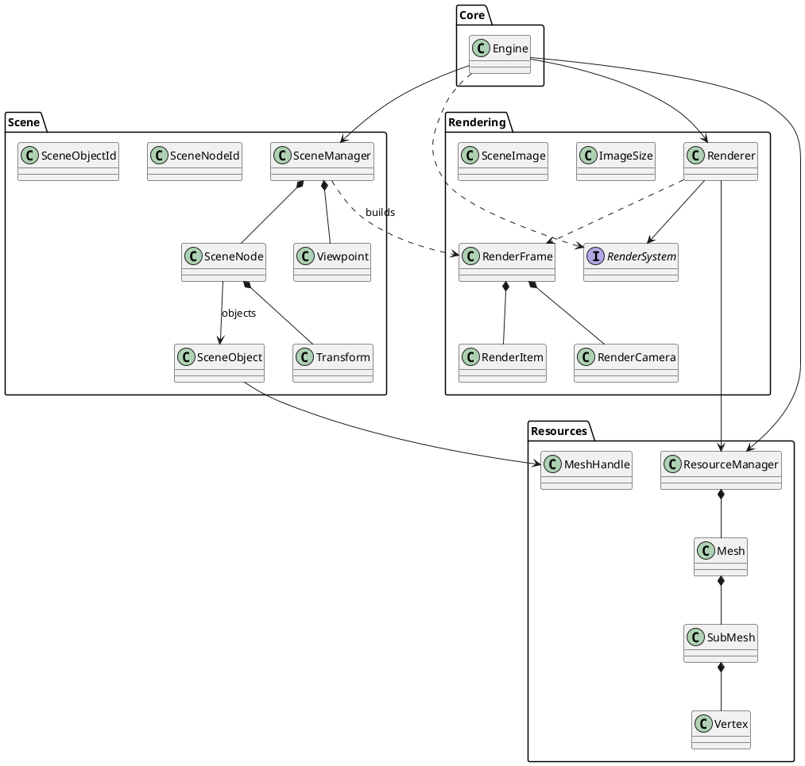
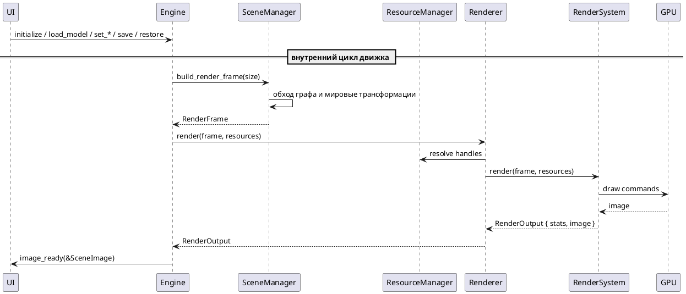
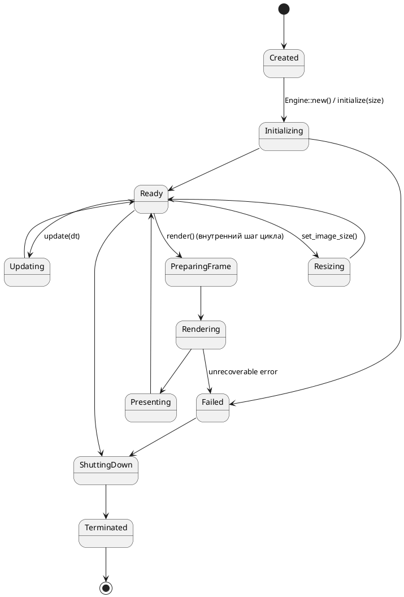
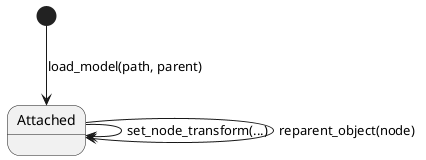
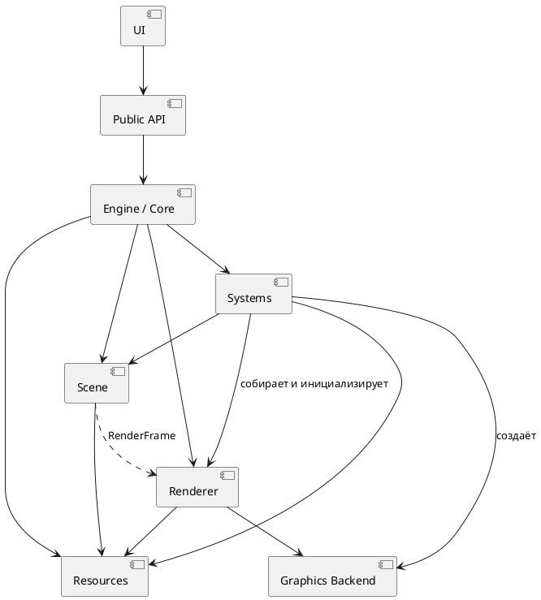

# FREAK Engine — архитектурная спецификация

## 1. Назначение документа

Этот документ фиксирует целевую архитектуру графического движка **FREAK Engine** на Rust.

Архитектура ориентируется прежде всего на идеи OGRE:

- `Root` как оркестратор;
- `SceneManager` как владелец сцены;
- `SceneNode` как пространственная иерархия;
- `MovableObject` как содержимое узла;
- `Entity` как экземпляр отображаемого объекта;
- `Mesh`, `Material`, `Texture` как разделяемые ресурсы;
- `RenderSystem` как абстракция конкретного графического API.

При этом архитектура не должна буквально копировать C++-модель OGRE. Она должна быть адаптирована к Rust и его типовой модели владения, ссылок, enum-типов и trait-интерфейсов.

---

# 2. Основные архитектурные принципы

1. Сцена должна быть отделена от рендеринга.
2. Пространственная иерархия должна быть отделена от отображаемого содержимого.
3. Экземпляр объекта сцены должен быть отделён от тяжёлого ресурса.
4. UI должен работать только через высокоуровневый публичный API движка.
5. Низкоуровневый renderer не должен знать о UI.
6. `Scene` не должна зависеть от конкретного GPU backend.
7. Основные зависимости между модулями должны быть однонаправленными.
8. Циклические зависимости между архитектурными модулями не допускаются.
9. Обратная передача данных должна происходить через возвращаемые значения, события или специализированные структуры данных.
10. Публичный API должен оперировать объектами предметной области, а не низкоуровневыми GPU-командами.

---

# 3. Главная архитектурная схема

```text
              UI / Editor / Client Application
                            |
                            v
                      Public Engine API
                            |
                            v
                          Engine
              +-------------+-------------+
              |             |             |
              v             v             v
            Scene       Resources       Systems
              |             |             |
              |             |             +--- сборка, инициализация
              |             |             |    и завершение частей
              |             |             +--- загрузка моделей,
              |             |                  save/restore сцены
              v             |
      build_render_frame    |
              |             |
              v             v
          RenderFrame --> Renderer
                            |
                            v
                       RenderSystem
                            |
                            v
                    wgpu (backend) --> GPU
```

`Systems` собирает, инициализирует и завершает части движка (`systems::lifecycle`), загружает модели и хранит сохранённую сцену.

---

# 4. Модуль `core`

## 4.1. Назначение

`core` содержит главный объект движка — `Engine`.

`Engine` является фасадом и оркестратором.

Он связывает:

- сцену;
- ресурсы;
- системы;
- renderer;
- lifecycle кадра.

## 4.2. Что делает `Engine`

`Engine` должен:

- инициализировать и завершать подсистемы (через `systems::lifecycle`);
- владеть или координировать основные модули;
- предоставлять публичную точку входа;
- выполнять `update`;
- инициировать `render`;
- управлять lifecycle движка;
- передавать данные между подсистемами.

## 4.3. Что `Engine` не должен делать

`Engine` не должен:

- самостоятельно хранить vertex/index data;
- самостоятельно создавать GPU draw calls;
- содержать UI;
- содержать бизнес-логику конкретного приложения;
- заменять собой SceneManager, ResourceManager или Renderer.

## 4.4. Предлагаемая структура

```rust
pub struct Engine {
    scene: SceneManager,
    resources: ResourceManager,
    renderer: Renderer,
    systems: SystemManager,
}
```

## 4.5. Минимальный публичный API

```rust
impl Engine {
    pub fn new() -> Self;

    // Публичные операции — трейт EngineApi (FREAK_Engine_Public_API.md);
    // initialize/shutdown выполняются через systems::lifecycle.

    // Внутренний цикл отображения:
    fn update(&mut self, dt: Duration) -> Result<(), EngineError>;
    fn render(&mut self) -> Result<(), EngineError>;
}
```

---

# 5. Модуль `scene`

## 5.1. Назначение

Модуль `scene` отвечает за:

> что существует в виртуальном мире и где оно расположено.

Он не должен выполнять GPU-команды.

## 5.2. Основные сущности

```text
SceneManager
SceneNode
Transform
SceneObject
Viewpoint
SceneNodeId
SceneObjectId
```

---

# 6. `SceneManager`

## 6.1. Ответственность

`SceneManager` является владельцем логической сцены.

Он должен:

- хранить корневой `SceneNode`;
- создавать nodes;
- создавать объекты сцены из загруженных моделей;
- прикреплять объекты к nodes и перепривязывать их к другим узлам;
- хранить единственную точку обзора (вне иерархии узлов);
- предоставлять traversal scene graph;
- подготавливать данные для RenderFrame.

## 6.2. Возможная структура

```rust
pub struct SceneManager {
    root: SceneNodeId,
    nodes: Vec<SceneNode>,
    objects: Vec<SceneObject>,
    viewpoint: ViewpointState,
}
```

В v1 ничего не удаляется, поэтому достаточно `Vec`; конкретное хранилище — внутренняя деталь, идентификаторы непрозрачны.

## 6.3. Главное правило

`SceneManager` знает структуру сцены, но не знает, как GPU рисует её содержимое.

---

# 7. `SceneNode`

## 7.1. Назначение

`SceneNode` отвечает за:

> WHERE — где находится объект.

Он описывает пространственную иерархию.

## 7.2. Возможная структура

```rust
pub struct SceneNode {
    parent: Option<SceneNodeId>,
    children: Vec<SceneNodeId>,
    objects: Vec<SceneObjectId>,
    local_transform: Transform,
}
```

## 7.3. В `SceneNode` должны находиться

```text
position
rotation
scale
parent
children
attached objects
```

## 7.4. В `SceneNode` не должны находиться

```text
Mesh
Texture
GPU Buffer
RenderPipeline
Shader Module
```

---

# 8. `Transform`

Преобразование — положение, поворот и масштаб.

```rust
pub struct Transform {
    pub translation: Vec3,
    pub rotation: Quat,
    pub scale: Vec3,
}
```

`Transform` есть только у `SceneNode` (локальное преобразование в иерархии). `SceneObject` собственного преобразования не хранит — положение, поворот и масштаб объекта определяются узлом, к которому он привязан. Мировая трансформация вычисляется при обходе сцены и не хранится постоянно:

```text
world_transform = parent_world_transform * local_transform
```

# 9. `SceneObjectId`

В первой версии объект сцены один — объект загруженной модели. Идентификаторы непрозрачны для клиента и strongly typed:

```rust
pub struct SceneObjectId(/* private */ u32);
```

Точка обзора объектом сцены не является и в иерархию не входит (см. §11). Источники света и другие виды объектов (enum-расширение `SceneObjectId`) — после v1.

---

# 10. `SceneObject`

## 10.1. Назначение

`SceneObject` — экземпляр отображаемого объекта в сцене (объект загруженной модели).

Его семантика:

> WHAT — что находится в SceneNode.

## 10.2. Возможная структура

```rust
pub struct SceneObject {
    mesh: MeshHandle,
}
```

Собственного преобразования у объекта нет: положение, поворот и масштаб определяются узлом, к которому он привязан (§7, §8).

## 10.3. Главное правило

`SceneObject` не должен содержать vertex/index data напрямую.

Он должен ссылаться на ресурсы.

```text
SceneObject ---> MeshHandle ---> Mesh
```

Один `Mesh` может использоваться несколькими `SceneObject`.

Удаление, скрытие и подмена внешнего вида объекта — после v1 (ФТ-15, ФТ-16, ФТ-23).

---

# 11. `Viewpoint`

Точка обзора одна на сцену и управляется независимо от иерархии узлов (ФТ-18).

```rust
pub struct ViewpointState {
    pub position: Vec3,
    pub direction: Vec3, // направление взгляда
    pub fov_y: f32,      // вертикальный угол обзора, радианы
}
```

Значения по умолчанию: позиция `(0, 0, 5)`, взгляд вдоль `-Z`, угол обзора 60°.

Ортографическая проекция и несколько точек обзора — после v1.

---

# 12. `Light`

```text
SceneNode
   |
   + Transform
   |
   + Light
```

```rust
pub struct Light {
    pub kind: LightType,
    pub color: Vec3,
    pub intensity: f32,
}
```

Положение источника света не должно храниться внутри `Light`.

**После v1.** В первой версии источников света нет (см. требования).

---

# 13. Модуль `resources`

## 13.1. Назначение

Resources отвечают за разделяемые данные моделей (в v1 — геометрия и общий простой цвет модели).

## 13.2. Основные сущности

```text
ResourceManager
Mesh
SubMesh
Vertex
MeshHandle
```

`Material`, `Texture`, `Shader` — после v1.

---

# 14. `ResourceManager`

```rust
pub struct ResourceManager {
    meshes: Vec<Mesh>,
}
```

Публичные handles:

```rust
MeshHandle
```

Handles должны быть strongly typed и непрозрачны для клиента. `MaterialHandle`/`TextureHandle`/`ShaderHandle` — после v1.

---

# 15. `Mesh`

`Mesh` является ресурсом геометрии и общего простого цвета модели.

```rust
pub struct Mesh {
    submeshes: Vec<SubMesh>,
    color: [f32; 4], // linear RGBA, общий цвет модели
}
```

```rust
pub struct SubMesh {
    vertices: Vec<Vertex>,
    indices: Vec<u32>,
}
```

```rust
pub struct Vertex {
    position: Vec3,
}
```

Нормали и текстурные координаты — после v1 (вместе с освещением и текстурами).

---

# 16. Вне первой версии: `Material`, `Texture`, `Shader`

В первой версии внешний вид — один простой цвет модели, хранимый в `Mesh` (§15). Клиент не может переопределять внешний вид (ФТ-23).

После v1: `Material` (base color, затем metallic/roughness/normal map/emission/transparency), `Texture`, `Shader` как разделяемые ресурсы; handles `MaterialHandle`/`TextureHandle`/`ShaderHandle`.

---

# 17. Принцип Resource vs Instance

Это один из ключевых invariants системы.

```text
Mesh        != SceneObject
SceneNode   != SceneObject
```

Связь:

```text
SceneNode
    |
    + SceneObject
        |
        + MeshHandle --------> Mesh (геометрия + цвет модели)
```

`Material`, `Texture`, `Shader` добавляются после v1 по той же схеме (ресурс ≠ экземпляр).

---

# 18. Модуль `systems`

Systems отвечают за жизненный цикл и файловые операции: собирают, инициализируют и завершают части движка, загружают модели и сохраняют/восстанавливают сцену. Клиент не подключает собственные системы (см. требования).

```rust
pub struct EngineParts {
    pub scene: SceneManager,
    pub resources: ResourceManager,
    pub renderer: Renderer,
    pub store: SceneStore,
}

pub fn create() -> EngineParts;

pub fn initialize(
    parts: &mut EngineParts,
    image_size: ImageSize,
) -> Result<(), LifecycleError>;

pub fn shutdown(parts: &mut EngineParts) -> Result<(), LifecycleError>;

pub fn load_model(
    path: &Path,
    resources: &mut ResourceManager,
    scene: &mut SceneManager,
    parent: SceneNodeId,
) -> Result<SceneObjectId, ModelLoadError>;

pub struct SceneStore { /* private */ }

pub fn save_scene(
    store: &mut SceneStore,
    scene: &SceneManager,
    resources: &ResourceManager,
) -> Result<(), ScenePersistenceError>;

pub fn restore_scene(
    store: &mut SceneStore,
    scene: &mut SceneManager,
    resources: &mut ResourceManager,
) -> Result<(), ScenePersistenceError>;
```

`create` собирает части, `initialize` инициализирует графику и задаёт размер изображения, `shutdown` завершает работу; ошибки жизненного цикла — `LifecycleError`. В первой версии сохранение хранится в памяти движка; формат файла — после v1.

`System` trait не создаётся: заменяемые реализации систем не нужны, trait оправдан только там, где действительно нужна замена (см. §44), прежде всего для `RenderSystem`. Отсечение невидимого, анимационные и прочие системы — после v1.

---

# 19. Frame Preparation

Между Scene и Renderer должна существовать отдельная граница данных.

Renderer не должен напрямую обходить внутренние структуры `SceneManager`.

Нужно формировать отдельную структуру `RenderFrame`.

---

# 20. `RenderFrame`

```rust
pub struct RenderFrame {
    pub camera: RenderCamera,
    pub items: Vec<RenderItem>,
}
```

```rust
pub struct RenderItem {
    pub world_transform: Mat4,
    pub mesh: MeshHandle,
}
```

```rust
pub struct RenderCamera {
    pub view: Mat4,
    pub projection: Mat4,
}
```

`lights` и `material` в кадре — после v1.

---

# 21. Основной pipeline кадра

```text
Scene
  |
  | traversal
  v
Scene Graph
  |
  | world-transform calculation
  v
item collection
  |
  v
RenderFrame
  |
  v
Renderer
  |
  v
RenderSystem
  |
  v
GPU
```

---

# 22. Renderer

Renderer отвечает за:

> HOW — как превратить RenderFrame в изображение.

Renderer не должен:

- менять Scene;
- знать о UI;
- принимать пользовательские команды;
- хранить бизнес-логику;
- знать, почему объект оказался в конкретной позиции.

```rust
pub struct Renderer {
    render_system: Box<dyn RenderSystem>,
}
```

---

# 23. `RenderSystem`

`RenderSystem` является интерфейсом между renderer и конкретным GPU backend.

В первой версии рендеринг offscreen: backend рисует в собственный буфер и возвращает `RenderOutput` (статистика + `SceneImage`). Окна и поверхности (`RenderSurface`) в v1 нет.

```rust
pub trait RenderSystem {
    fn initialize(&mut self) -> Result<(), RenderError>;

    fn resize(&mut self, size: ImageSize) -> Result<(), RenderError>;

    fn render(
        &mut self,
        frame: &RenderFrame,
        resources: &ResourceManager,
    ) -> Result<RenderOutput, RenderError>;

    fn shutdown(&mut self);
}
```

```rust
pub struct RenderOutput {
    pub stats: RenderStats,
    pub image: SceneImage,
}
```

---

# 24. GPU backend

Конкретные реализации:

```text
RenderSystem
      ^
      |
+-----+--------+
|              |
WgpuBackend   VulkanBackend (после v1)
```

На первом этапе следует реализовать только один backend — `wgpu`.

Архитектура должна позволять добавить другой backend позже, но не нужно проектировать чрезмерно сложный слой заранее.

---

# 25. Public API

UI не должен иметь доступ к GPU API.

UI должен видеть:

```text
Engine
Scene API
загрузка моделей (load_model)
high-level settings (размер изображения и т.п.)
```

UI не должен видеть:

```text
Device
Queue
CommandEncoder
CommandBuffer
BindGroup
Pipeline
DescriptorSet
VkDevice
```

---

# 26. Scene API

```rust
pub trait SceneApi {
    fn root_node(&self) -> SceneNodeId;

    fn create_node(
        &mut self,
        parent: SceneNodeId,
    ) -> Result<SceneNodeId, SceneError>;

    fn set_node_transform(
        &mut self,
        node: SceneNodeId,
        transform: Transform,
    ) -> Result<(), SceneError>;

    fn reparent_object(
        &mut self,
        object: SceneObjectId,
        new_parent: SceneNodeId,
    ) -> Result<(), SceneError>;

    fn viewpoint(&self) -> ViewpointState;

    fn set_viewpoint(
        &mut self,
        state: ViewpointState,
    ) -> Result<(), SceneError>;
}
```

Внутренние операции `SceneManager` для движка (не клиентский API): `create_object(mesh, parent)` и `build_render_frame(size) -> RenderFrame`. Удаление узлов и объектов — после v1.

---

# 27. Resource API

У клиента нет отдельного Resource API: модель загружается через `EngineApi::load_model`. Внутренний интерфейс `ResourceManager`:

```rust
impl ResourceManager {
    pub(crate) fn add_mesh(&mut self, mesh: Mesh) -> MeshHandle;
    pub(crate) fn mesh(&self, handle: MeshHandle) -> Option<&Mesh>;
}
```

Загрузка текстур и создание материалов — после v1.

---

# 28. Типичный клиентский код

```rust
let mut engine = Engine::new();
engine.initialize(ImageSize::new(1280, 720))?;
engine.set_image_listener(Box::new(AppListener { /* ... */ }));

let root = engine.scene().root_node();
let node = engine.scene().create_node(root)?;

engine.load_model(Path::new("cube.gltf"), node)?;
engine.scene().set_node_transform(
    node,
    Transform::from_translation(Vec3::new(0.0, 0.0, -5.0)),
)?;

// Отрисовкой управляет сам движок; клиент получает изображения
// через ImageListener и не вызывает update/render.
engine.shutdown()?;
```

---

# 29. Dependency rules

Разрешённые направления зависимостей:

```text
UI -> Engine API

core -> scene, resources, systems, render

scene -> math, resources, render::frame (только DTO кадра)

render -> math, resources

backend -> render, resources, math

systems -> scene, resources, render, backend
```

Запрещённые зависимости:

```text
Scene -> Renderer
Scene -> RenderSystem
Scene -> wgpu

Resources -> UI

Renderer -> UI
Renderer -> SceneManager

RenderSystem -> SceneManager

Mesh -> SceneManager

GPU Backend -> Engine
```

---

# 30. Обратная связь между модулями

Не создавать двусторонние ownership-связи.

Плохо:

```rust
struct Scene {
    renderer: Renderer,
}

struct Renderer {
    scene: Scene,
}
```

Правильно использовать:

- аргументы методов;
- `Result`;
- события;
- immutable/mutable references;
- специализированные DTO/data structures.

Например:

```rust
let frame = scene.build_render_frame(...);

let output = renderer.render(
    &frame,
    &resources,
)?; // RenderOutput { stats, image }
```

---

# 31. Lifecycle одного кадра

`update`/`render` — внутренние шаги цикла движка; клиент их не вызывает.

```text
Idle
 |
 | Engine::update(dt) (внутренний шаг)
 v
Обновление подсистем
 |
 v
Scene updated
 |
 | Engine::render() (внутренний шаг)
 v
Scene traversal
 |
 v
World transform calculation
 |
 v
Item collection
 |
 v
Build RenderFrame
 |
 v
Renderer::render() -> RenderSystem draw commands
 |
 v
SceneImage -> ImageListener
 |
 v
Idle
```

---

# 32. Lifecycle объекта сцены

```text
Created
   |
   | attach (при загрузке модели)
   v
Attached
   |
   | set_node_transform / reparent_object
   v
Attached
```

Удаление, скрытие и состояние Detached — после v1 (ФТ-15, ФТ-16). API должен корректно обрабатывать некорректные переходы (неизвестный ID, перепривязка узла в собственного потомка).

---

# 33. Предлагаемая структура crate

На первом этапе желательно использовать один crate:

```text
freak-engine/   (крейт BFGE)
├── Cargo.toml
└── src/
    ├── lib.rs              # публичная поверхность (ре-экспорты)
    ├── math.rs             # ре-экспорт glam: Vec3, Quat, Mat4
    │
    ├── core/
    │   ├── mod.rs
    │   ├── api.rs          # EngineApi, ImageListener
    │   ├── engine.rs       # Engine
    │   └── error.rs        # EngineError
    │
    ├── scene/
    │   ├── mod.rs
    │   ├── api.rs          # SceneApi
    │   ├── ids.rs          # SceneNodeId, SceneObjectId
    │   ├── transform.rs    # Transform
    │   ├── node.rs         # SceneNode
    │   ├── object.rs       # SceneObject
    │   ├── viewpoint.rs    # ViewpointState
    │   ├── manager.rs      # SceneManager (+ build_render_frame)
    │   └── error.rs        # SceneError
    │
    ├── resources/
    │   ├── mod.rs
    │   ├── handle.rs       # MeshHandle
    │   ├── mesh.rs         # Vertex, SubMesh, Mesh
    │   └── manager.rs      # ResourceManager
    │
    ├── systems/
    │   ├── mod.rs
    │   ├── lifecycle.rs    # EngineParts, create/initialize/shutdown, LifecycleError
    │   ├── loading.rs      # load_model, ModelLoadError
    │   └── persistence.rs  # SceneStore, save/restore, ScenePersistenceError
    │
    ├── render/
    │   ├── mod.rs
    │   ├── frame.rs        # RenderFrame, RenderCamera, RenderItem
    │   ├── renderer.rs     # Renderer
    │   ├── system.rs       # RenderSystem, RenderOutput, RenderError
    │   ├── stats.rs        # RenderStats
    │   └── image.rs        # ImageSize, SceneImage
    │
    └── backend/
        ├── mod.rs
        └── wgpu/
            ├── mod.rs
            ├── backend.rs  # WgpuRenderSystem
            ├── pipeline.rs
            ├── buffer.rs
            └── texture.rs
```

---

# 34. UI как отдельный crate

Если имеется редактор, его следует отделить:

```text
workspace/
├── freak-engine/
└── freak-editor/
```

`freak-editor` зависит от `freak-engine`.

`freak-engine` не должен зависеть от редактора.

---

# 35. Что не нужно реализовывать в первой версии

Не следует преждевременно внедрять:

- полноценный ECS;
- render graph;
- frame graph;
- plugin framework;
- multithreaded renderer;
- async resource streaming;
- hot reload;
- LOD;
- instancing;
- batching;
- dependency injection framework;
- event bus;
- универсальную backend abstraction на множество API;
- сложную иерархию trait objects.

Подготовить архитектуру так, чтобы такие возможности можно было добавить позже.

---

# 36. MVP

Минимальная рабочая версия должна содержать:

```text
Engine, EngineApi, ImageListener

SceneManager, SceneApi
SceneNode, SceneObject
Transform, ViewpointState

Mesh, MeshHandle
ResourceManager

RenderFrame, RenderItem, RenderCamera

Renderer, RenderSystem, WgpuRenderSystem (скелет)

systems::lifecycle (сборка/инициализация/завершение частей), load_model (glTF/OBJ — интерфейс), save/restore сцены (в памяти)
```

MVP должен позволять:

```text
создать и инициализировать Engine
создать SceneNode
создать SceneObject из загруженной модели (load_model)
изменить Transform узла (объект следует за узлом)
перепривязать объект к другому узлу
задать точку обзора
сформировать RenderFrame
отрисовать кадр и получить SceneImage
сохранить и восстановить сцену (в памяти)
```

---

# 37. UML class diagram

Файл: `docs/arch.png` (перегенерировать из блока ниже после правок).



---

# 38. UML sequence diagram одного кадра

Файл: `docs/architecture/frame-sequence.puml`



---

# 39. UML state diagram Engine

Файл: `docs/architecture/engine-state.puml`



---

# 40. UML state diagram объекта сцены

Файл: `docs/architecture/object-state.puml`



Удаление и скрытие — после v1 (ФТ-15, ФТ-16).

---

# 41. UML component diagram

Файл: `docs/architecture/components.puml`



---

# 42. Формальное описание границ

## 42.1. Scene

Scene отвечает за:

```text
что существует
где это находится
как объекты связаны иерархически
```

Scene не отвечает за:

```text
GPU commands
pipelines
swapchain
command buffers
UI
```

## 42.2. Resources

Resources отвечают за:

```text
какие повторно используемые данные существуют
```

Примеры:

```text
Mesh (геометрия + цвет модели)
MeshHandle
```

Текстуры, материалы, шейдеры — после v1.

## 42.3. Systems

Systems отвечают за:

```text
сборку, инициализацию и завершение частей движка;
загрузку моделей и save/restore сцены
```

## 42.4. Renderer

Renderer отвечает за:

```text
как подготовленный RenderFrame превращается в изображение (offscreen: RenderOutput со SceneImage)
```

## 42.5. Engine

Engine отвечает за:

```text
когда и в каком порядке вызываются подсистемы
```

## 42.6. UI

UI отвечает за:

```text
что пользователь хочет сделать
```

---

# 43. Главные invariants

1. `SceneNode` отвечает за **WHERE**.
2. `SceneObject` отвечает за **WHAT**.
3. `Mesh` является resource, `SceneObject` — instance.
4. Scene не выполняет GPU-команды.
5. Renderer не изменяет Scene.
6. RenderSystem не знает о SceneManager.
7. UI не знает о GPU backend.
8. Engine является orchestrator/facade.
9. Между Scene и Renderer передаётся `RenderFrame`.
10. Один `Mesh` может использоваться несколькими `SceneObject`.
11. `Transform` есть только у `SceneNode`; положение объекта определяется его узлом, мировая трансформация вычисляется при сборке кадра.
12. Точка обзора одна и не входит в иерархию узлов.
13. Resource handles должны быть strongly typed.
14. Клиент не удаляет и не скрывает объекты и не переопределяет внешний вид (v1).
15. Dependency graph не должен иметь циклов.

---

# 44. Инструкция Codex-агенту

Сначала создать архитектурный skeleton проекта:

- module declarations;
- основные типы;
- strongly typed IDs;
- публичные API;
- trait boundaries;
- `RenderFrame`;
- ошибки;
- UML-документацию.

Не реализовывать полноценный GPU renderer до завершения архитектурного skeleton.

Все публичные сущности должны иметь Rustdoc.

Для ещё не реализованной логики допустимо использовать `todo!()`, если это позволяет сохранить целевые сигнатуры и архитектурные связи.

Не добавлять новые архитектурные сущности без необходимости.

Не внедрять в первой версии:

- ECS framework;
- event bus;
- plugin framework;
- dependency injection framework;
- render graph;
- сложную trait hierarchy.

Предпочитать:

- конкретные Rust-типы;
- enums;
- strongly typed handles;
- ownership через manager-объекты;

сложным иерархиям `dyn Trait`.

Trait использовать там, где действительно нужна заменяемая реализация, прежде всего для `RenderSystem`.

Главная цель первой итерации:

> получить чистые границы модулей, компилируемый публичный API и понятную модель взаимодействия, а не полноценный production renderer.

---

# 45. Краткая архитектурная формула

```text
Scene знает, ЧТО существует и ГДЕ оно находится.

SceneNode знает WHERE.

SceneObject знает WHAT.

Mesh и MeshHandle знают, КАКИЕ разделяемые данные существуют.

Systems знают, КАК собрать, инициализировать и завершить части движка, загрузить модель и сохранить/восстановить сцену.

build_render_frame знает, ЧТО должно попасть в конкретный кадр.

Renderer знает, КАК превратить кадр в GPU-команды.

RenderSystem знает, КАК выполнить эти команды через конкретный backend.

Engine знает, КОГДА и В КАКОМ ПОРЯДКЕ вызвать подсистемы.

UI знает, ЧТО пользователь хочет сделать.
```

---
